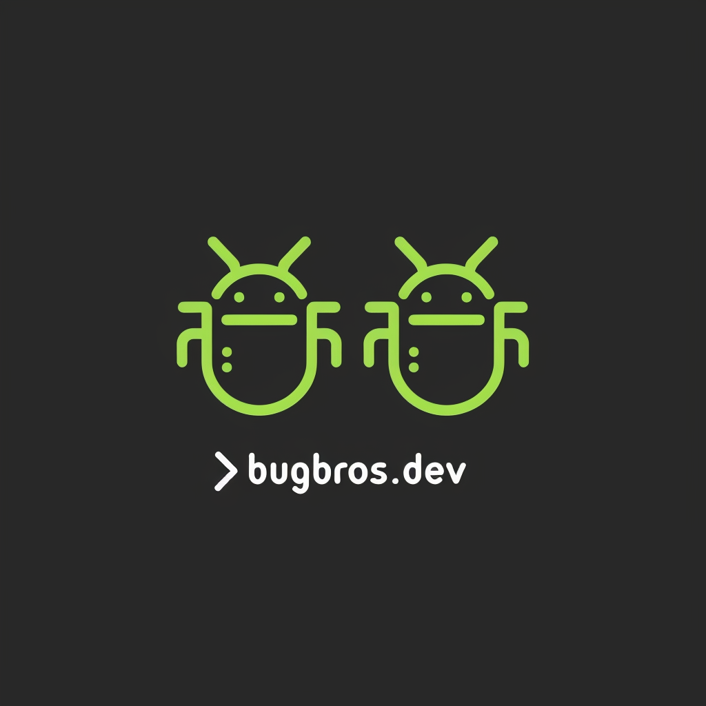

# 🐛 BugBros.dev

**Welcome to the official BugBros.dev GitHub organization!** We're not your typical developers. We're a team of bug-fighting superheroes, crafting cutting-edge microservices, DevOps magic, and scalable architectures that make your business run smoother than a freshly debugged codebase.

---

## 🛠️ **What We Do** 🛠️

- **Microservices & Cloud Architecture**: We build systems so scalable, they could power a moon base... if needed.
- **DevOps Magic**: We automate everything (seriously, EVERYTHING), so you don’t have to press the same button twice. 💻✨
- **IT Consulting**: Need expert advice? We speak fluent *business* and *technology*.
- **Bug Fighting**: Bugs tremble when they hear our name. 🐜🦸‍♂️

> 🧠 **Pro Tip**: "The only bug we can’t squash is the one you don’t tell us about!"

---

## 📂 **Our Repos** 📂

Here you’ll find our collection of repositories, showcasing the bleeding-edge of what we’re building. We're big on:
- **Semantic Versioning**: We version like pros, no surprises when you update! 🔄
- **Conventional Commits**: We’re serious about our commit messages. Expect clarity and detail in everything we do.
  
  > 🛑 **Pro Tip**: "If it’s not versioned, did it really happen?"

---

## 📞 **Get in Touch** 📞

We’re always up for a chat or to lend a hand with your IT needs. Reach out and let’s build something awesome together:

- **Email**: [null@bugbros.dev](mailto:null@bugbros.dev)  
*We promise we don’t send bugs… only solutions!*

---

> 💡 **Fun Fact**: "Our favorite pastime? Squashing bugs with style and elegance. What’s yours?"
  
---

*"Building a bug-free future, one microservice at a time."*
